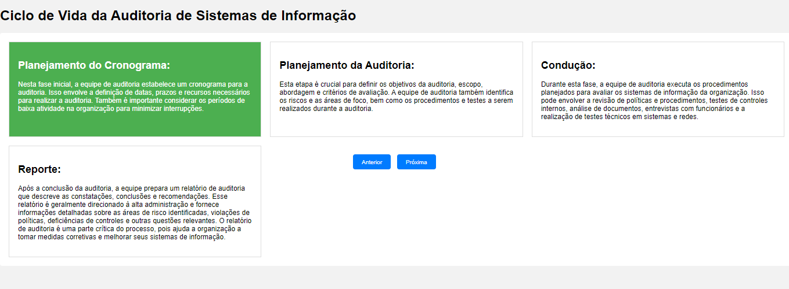

# Ciclo de Vida da Auditoria de Sistemas de Informação

O ciclo de vida da auditoria de sistemas de informação é um processo estruturado que envolve várias etapas para avaliar a eficácia, a segurança e a conformidade dos sistemas de informação de uma organização. A seguir estão as etapas típicas desse ciclo:

## Planejamento do Cronograma

Nesta fase inicial, a equipe de auditoria estabelece um cronograma para a auditoria. Isso envolve a definição de datas, prazos e recursos necessários para realizar a auditoria. Também é importante considerar os períodos de baixa atividade na organização para minimizar interrupções.

## Planejamento da Auditoria

Esta etapa é crucial para definir os objetivos da auditoria, escopo, abordagem e critérios de avaliação. A equipe de auditoria também identifica os riscos e as áreas de foco, bem como os procedimentos e testes a serem realizados durante a auditoria.

## Condução

Durante esta fase, a equipe de auditoria executa os procedimentos planejados para avaliar os sistemas de informação da organização. Isso pode envolver a revisão de políticas e procedimentos, testes de controles internos, análise de documentos, entrevistas com funcionários e a realização de testes técnicos em sistemas e redes.

## Reporte

Após a conclusão da auditoria, a equipe prepara um relatório de auditoria que descreve as constatações, conclusões e recomendações. Esse relatório é geralmente direcionado à alta administração e fornece informações detalhadas sobre as áreas de risco identificadas, violações de políticas, deficiências de controles e outras questões relevantes. O relatório de auditoria é uma parte crítica do processo, pois ajuda a organização a tomar medidas corretivas e melhorar seus sistemas de informação.

Além dessas etapas principais, é importante destacar que a auditoria de sistemas de informação também pode envolver atividades de acompanhamento e revisão para garantir que as recomendações sejam implementadas de forma eficaz e que as deficiências identificadas sejam corrigidas.

É essencial que as auditorias de sistemas de informação sejam conduzidas regularmente para garantir a segurança e a eficiência contínuas dos sistemas de informação de uma organização, especialmente em um ambiente onde as ameaças e os desafios de segurança estão em constante evolução.
