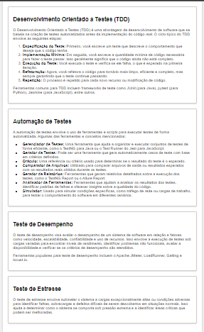

# Desenvolvimento Orientado a Testes (TDD) e Testes Específicos

## Desenvolvimento Orientado a Testes (TDD)

O **Desenvolvimento Orientado a Testes (TDD)** é uma abordagem de desenvolvimento de software que se baseia na criação de testes automatizados antes da implementação do código real. O ciclo típico do TDD envolve as seguintes etapas:

1. **Especificação do Teste:** Primeiro, você escreve um teste que descreve o comportamento que deseja que o código tenha.

2. **Implementação Mínima:** Em seguida, você escreve a quantidade mínima de código necessária para fazer o teste passar. Isso geralmente significa que o código ainda não está completo.

3. **Execução do Teste:** Você executa o teste e verifica se ele falha, o que é esperado na primeira iteração.

4. **Refatoração:** Agora, você refatora o código para torná-lo mais limpo, eficiente e completo, mas sempre garantindo que o teste continue passando.

5. **Repetição:** O processo é repetido para cada novo recurso ou modificação de código.

Ferramentas comuns para TDD incluem frameworks de teste como JUnit (para Java), pytest (para Python), Jasmine (para JavaScript), entre outros.

## Automação de Testes

A **automação de testes** envolve o uso de ferramentas e scripts para executar testes de forma automatizada. Algumas das ferramentas e conceitos mencionados incluem:

- **Gerenciador de Testes:** Uma ferramenta que ajuda a organizar e executar conjuntos de testes de forma eficiente, como o TestNG para Java ou o Test Runner do Jest para JavaScript.

- **Gerador de Testes:** Pode ser uma ferramenta que gera automaticamente casos de teste com base em critérios definidos.

- **Oráculo:** Uma referência ou critério usado para determinar se o resultado do teste é o esperado.

- **Comparador de Arquivos:** Utilizado para comparar arquivos de saída ou resultados esperados com os resultados reais obtidos durante os testes.

- **Gerador de Relatórios:** Ferramentas que geram relatórios detalhados sobre a execução dos testes, como o TestNG Report ou o Allure Report.

- **Analisador de Ferramentas:** Ferramentas que ajudam a analisar os resultados dos testes, identificar padrões de falhas e oferecer insights sobre a qualidade do código.

- **Simulador:** Usado para simular condições específicas, como tráfego de rede ou cargas de trabalho, para testar o comportamento do software em diferentes cenários.

## Teste de Desempenho

O **teste de desempenho** visa avaliar o desempenho de um sistema de software em relação a fatores como velocidade, escalabilidade, confiabilidade e uso de recursos. Isso envolve a execução de testes sob cargas variadas para encontrar níveis de rendimento, identificar problemas não funcionais, avaliar a disponibilidade e verificar se os critérios de desempenho são atendidos.

Ferramentas populares para teste de desempenho incluem o Apache JMeter, LoadRunner, Gatling e locust.io.

## Teste de Estresse

O **teste de estresse** envolve submeter o sistema a cargas excepcionalmente altas ou condições adversas para identificar falhas, sobrecargas e defeitos difíceis de serem descobertos em situações normais. Isso ajuda a determinar como o sistema se comporta sob pressão extrema e a identificar áreas críticas que podem ser melhoradas.

Ferramentas de teste de estresse podem variar, mas algumas delas são as mesmas usadas no teste de desempenho, com configurações específicas para criar condições de estresse.

## Erros de uma Aplicação Web e seus Processos de Teste (Pirâmide de Pressman)

A **Pirâmide de Testes de Pressman** é uma representação visual que descreve a distribuição de testes em diferentes níveis de granularidade em uma aplicação web. Ela ajuda a entender como diferentes tipos de testes se relacionam e a importância de cada um deles. A pirâmide de Pressman geralmente é dividida em três camadas:

- **Testes de Unidade:** Na base da pirâmide, estão os testes de unidade, que verificam unidades individuais de código, como funções ou métodos. Eles são executados com frequência e são os mais rápidos de serem executados.

- **Testes de Integração:** No meio da pirâmide, estão os testes de integração, que avaliam como diferentes partes do sistema interagem entre si. Eles garantem que os componentes funcionem bem juntos.

- **Testes de Interface de Usuário (UI):** No topo da pirâmide, estão os testes de interface de usuário, que avaliam a experiência do usuário final. Isso inclui testes de aceitação, testes funcionais e testes de usabilidade.

Em resumo, a pirâmide de Pressman destaca a importância de começar com testes de unidade sólidos e, em seguida, adicionar testes de integração e de interface de usuário à medida que você avança na hierarquia de testes. Isso ajuda a garantir a qualidade do software de maneira eficiente.
