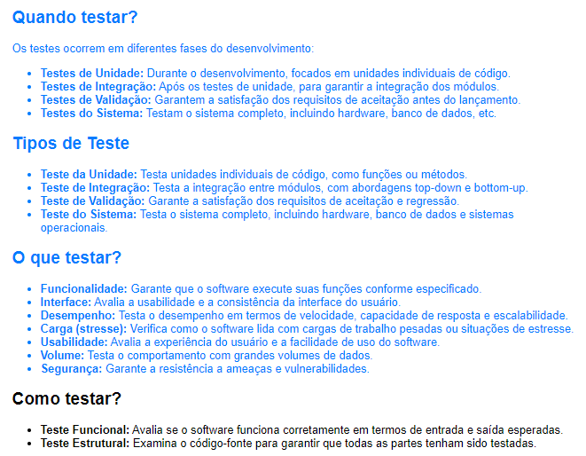

# Testes de Software: Considerações Gerais

Testar é uma parte fundamental do processo de desenvolvimento de software, e o momento e a abordagem dos testes podem variar de acordo com a metodologia de desenvolvimento adotada, como Agile, Waterfall ou DevOps. Aqui estão algumas considerações gerais sobre testes:

# Fase do Desenvolvimento

## Quando Testar?

### Testes de Unidade
- São realizados durante o desenvolvimento, à medida que os módulos ou componentes do software são criados.
- Concentram-se em testar unidades individuais de código, como funções ou métodos.

### Testes de Integração
- São conduzidos após os testes de unidade, quando os módulos são combinados para garantir que funcionem bem juntos.
- Existem abordagens top-down (testando de cima para baixo) e bottom-up (testando de baixo para cima).

### Testes de Validação
- São realizados para garantir que o software atenda aos requisitos de aceitação estabelecidos pelo cliente ou partes interessadas.
- Normalmente acontecem antes do lançamento oficial do software.

### Testes do Sistema
- Testam o sistema como um todo, incluindo integrações com hardware, bancos de dados e sistemas operacionais.
- Podem incluir testes de aceitação e regressão.

## O Que Testar?

- **Funcionalidade:** Garante que o software execute suas funções conforme especificado.
- **Interface:** Avalia a usabilidade e a consistência da interface do usuário.
- **Desempenho:** Testa como o software se comporta em termos de velocidade, capacidade de resposta e escalabilidade.
- **Carga (stresse):** Verifica como o software lida com cargas de trabalho pesadas ou situações de estresse.
- **Usabilidade:** Avalia a experiência do usuário e a facilidade de uso do software.
- **Volume:** Testa como o software se comporta quando há um grande volume de dados.
- **Segurança:** Garante que o software seja resistente a ameaças e vulnerabilidades.

## Como Testar?

### Teste Funcional
- Avalia se o software funciona corretamente em termos de entrada e saída esperadas.
- Envolve o uso de casos de teste que abrangem diferentes cenários de uso.

### Teste Estrutural
- Examina o código-fonte para garantir que todas as partes do código tenham sido testadas.
- Pode envolver testes de cobertura de código, como testes de ramificação e testes de caminho.

### Depuração: aplicações
- A necessidade da depuração decorre de um teste mal-sucedido. A depuração geralmente é necessária quando um programa ou código não funciona como esperado, após um teste ou execução inicial.
- Um dos recursos da depuração inclui a inspeção de variáveis. Uma das principais técnicas de depuração envolve a inspeção e monitoramento das variáveis do programa para entender como seus valores estão mudando e identificar possíveis problemas.
- A depuração é um processo que ocorre após testes, quando problemas são identificados, a fim de encontrar e corrigir erros no código. Não se trata de simplificar o teste, mas sim de identificar e corrigir os problemas que surgiram durante a execução ou teste do programa.

Além disso, é importante mencionar a automação de testes, que pode ajudar a acelerar o processo de testes, especialmente em cenários de desenvolvimento ágil e DevOps. Ferramentas de automação de testes podem ser usadas para criar e executar testes repetitivos de forma eficiente.

Lembre-se de que a estratégia de teste deve ser adaptada às necessidades específicas do projeto e às prioridades dos requisitos do software. A colaboração entre desenvolvedores, testadores e partes interessadas é essencial para garantir que os testes sejam bem-sucedidos e que o software atenda às expectativas.
