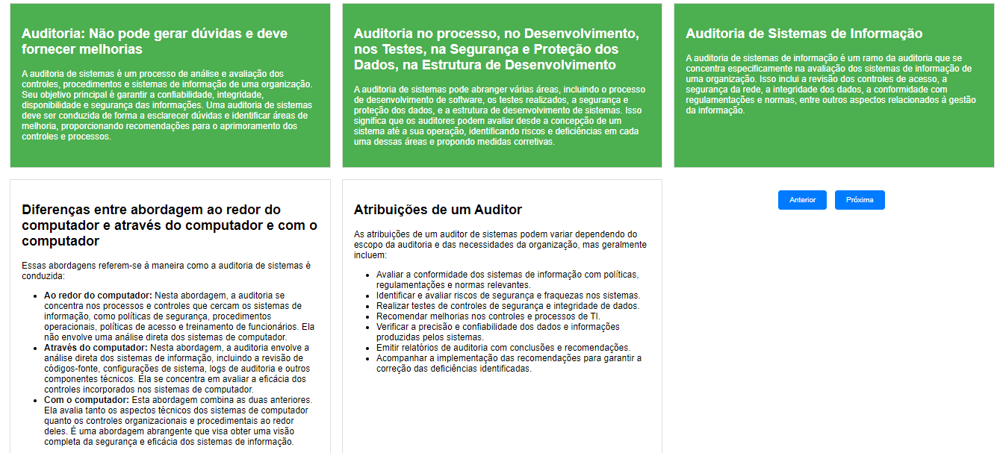

# Fundamentos de Auditoria de Sistemas

## Auditoria: Não pode gerar dúvidas e deve fornecer melhorias
A auditoria de sistemas é um processo de análise e avaliação dos controles, procedimentos e sistemas de informação de uma organização. Seu objetivo principal é garantir a confiabilidade, integridade, disponibilidade e segurança das informações. Uma auditoria de sistemas deve ser conduzida de forma a esclarecer dúvidas e identificar áreas de melhoria, proporcionando recomendações para o aprimoramento dos controles e processos.

## Auditoria no processo, no Desenvolvimento, nos Testes, na Segurança e Proteção dos Dados, na Estrutura de Desenvolvimento
A auditoria de sistemas pode abranger várias áreas, incluindo o processo de desenvolvimento de software, os testes realizados, a segurança e proteção dos dados, e a estrutura de desenvolvimento de sistemas. Isso significa que os auditores podem avaliar desde a concepção de um sistema até a sua operação, identificando riscos e deficiências em cada uma dessas áreas e propondo medidas corretivas.

## Auditoria de Sistemas de Informação
A auditoria de sistemas de informação é um ramo da auditoria que se concentra especificamente na avaliação dos sistemas de informação de uma organização. Isso inclui a revisão dos controles de acesso, a segurança da rede, a integridade dos dados, a conformidade com regulamentações e normas, entre outros aspectos relacionados à gestão da informação.

## Diferenças entre abordagem ao redor do computador e através do computador e com o computador
Essas abordagens referem-se à maneira como a auditoria de sistemas é conduzida:

- **Ao redor do computador:** Nesta abordagem, a auditoria se concentra nos processos e controles que cercam os sistemas de informação, como políticas de segurança, procedimentos operacionais, políticas de acesso e treinamento de funcionários. Ela não envolve uma análise direta dos sistemas de computador.

- **Através do computador:** Nesta abordagem, a auditoria envolve a análise direta dos sistemas de informação, incluindo a revisão de códigos-fonte, configurações de sistema, logs de auditoria e outros componentes técnicos. Ela se concentra em avaliar a eficácia dos controles incorporados nos sistemas de computador.

- **Com o computador:** Esta abordagem combina as duas anteriores. Ela avalia tanto os aspectos técnicos dos sistemas de computador quanto os controles organizacionais e procedimentais ao redor deles. É uma abordagem abrangente que visa obter uma visão completa da segurança e eficácia dos sistemas de informação.

## Atribuições de um Auditor
As atribuições de um auditor de sistemas podem variar dependendo do escopo da auditoria e das necessidades da organização, mas geralmente incluem:

- Avaliar a conformidade dos sistemas de informação com políticas, regulamentações e normas relevantes.
- Identificar e avaliar riscos de segurança e fraquezas nos sistemas.
- Realizar testes de controles de segurança e integridade de dados.
- Recomendar melhorias nos controles e processos de TI.
- Verificar a precisão e confiabilidade dos dados e informações produzidas pelos sistemas.
- Emitir relatórios de auditoria com conclusões e recomendações.
- Acompanhar a implementação das recomendações para garantir a correção das deficiências identificadas.
