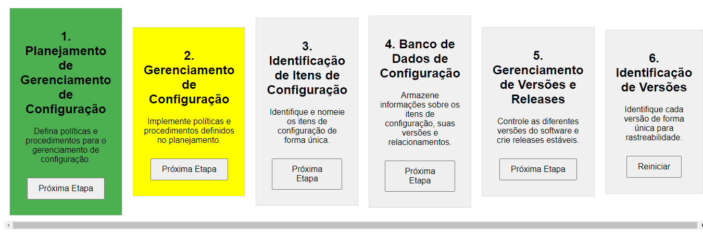

# Gestão de Configuração

A **Gestão de Configuração de Software** (ou SCM, do inglês *Software Configuration Management*) é uma parte crucial da Engenharia de Software que lida com o controle e a administração das mudanças no software ao longo de seu ciclo de vida. Ela se concentra em manter a integridade do software, garantindo que diferentes versões e configurações sejam gerenciadas de forma eficaz. Abaixo estão alguns aspectos importantes da Gestão de Configuração:

## Planejamento de Gerenciamento de Configuração

Isso envolve a definição de políticas, processos e procedimentos para gerenciar a configuração do software. O objetivo é estabelecer um plano para controlar as mudanças e as versões.

## Gerenciamento de Configuração

O gerenciamento de configuração envolve a implementação das políticas e procedimentos definidos no planejamento. Isso inclui a identificação e o controle de itens de configuração.

## Itens de Configuração (ICs)

Os itens de configuração são os elementos do software que precisam ser gerenciados, como código-fonte, documentos, artefatos de teste e recursos relacionados ao projeto.

## Identificação de Itens de Configuração

Esse processo consiste em identificar e nomear os itens de configuração de maneira única, para que possam ser rastreados e gerenciados com eficiência.

## Banco de Dados de Configuração

É um repositório que armazena informações sobre os itens de configuração, suas versões e relacionamentos. Isso permite o rastreamento e a recuperação de versões específicas do software.

## Gerenciamento de Versões e Releases

Isso abrange o controle das diferentes versões do software e a criação de releases estáveis. O controle de versões permite rastrear alterações ao longo do tempo, enquanto as releases representam versões específicas do software entregues aos usuários.

## Identificação de Versões

Cada versão do software é identificada de forma única para facilitar sua rastreabilidade e recuperação.

A Gestão de Configuração é fundamental para garantir que as mudanças no software sejam controladas, documentadas e rastreadas ao longo do ciclo de vida do projeto, o que contribui para a qualidade e a confiabilidade do software entregue aos usuários.
