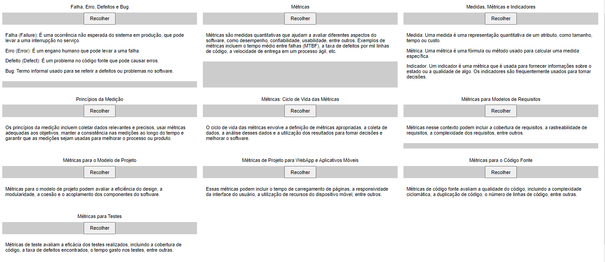

## Medição da Qualidade (Métricas e Indicadores)

A medição da qualidade no desenvolvimento de software envolve a coleta e análise de dados para avaliar o quão bem um sistema de software atende aos requisitos e expectativas. Isso é feito por meio de métricas e indicadores. Vamos abordar cada parte deste tópico:

### Falha, Erro, Defeitos e Bug:

- **Falha (Failure):** É uma ocorrência não esperada do sistema em produção, que pode levar a uma interrupção no serviço.
- **Erro (Error):** É um engano humano que pode levar a uma falha.
- **Defeito (Defect):** É um problema no código fonte que pode causar erros.
- **Bug:** Termo informal usado para se referir a defeitos ou problemas no software.

### Métricas:

Métricas são medidas quantitativas que ajudam a avaliar diferentes aspectos do software, como desempenho, confiabilidade, usabilidade, entre outros. Exemplos de métricas incluem o tempo médio entre falhas (MTBF), a taxa de defeitos por mil linhas de código, a velocidade de entrega em um processo ágil, etc.

### Medidas, Métricas e Indicadores:

- **Medida:** Uma medida é uma representação quantitativa de um atributo, como tamanho, tempo ou custo.
- **Métrica:** Uma métrica é uma fórmula ou método usado para calcular uma medida específica.
- **Indicador:** Um indicador é uma métrica que é usada para fornecer informações sobre o estado ou a qualidade de algo. Os indicadores são frequentemente usados para tomar decisões.

### Princípios da Medição:

Os princípios da medição incluem coletar dados relevantes e precisos, usar métricas adequadas aos objetivos, manter a consistência nas medições ao longo do tempo e garantir que as medições sejam usadas para melhorar o processo ou produto.

### Métricas: Ciclo de Vida das Métricas:

O ciclo de vida das métricas envolve a definição de métricas apropriadas, a coleta de dados, a análise desses dados e a utilização dos resultados para tomar decisões e melhorar o software.

### Métricas para Modelos de Requisitos:

Métricas nesse contexto podem incluir a cobertura de requisitos, a rastreabilidade de requisitos, a complexidade dos requisitos, entre outros.

### Métricas para o Modelo de Projeto:

Métricas para o modelo de projeto podem avaliar a eficiência do design, a modularidade, a coesão e a acoplamento dos componentes do software.

### Métricas de Projeto para WebApp e Aplicativos Móveis:

Essas métricas podem incluir o tempo de carregamento de páginas, a responsividade da interface do usuário, a utilização de recursos do dispositivo móvel, entre outros.

### Métricas para o Código Fonte:

Métricas de código fonte avaliam a qualidade do código, incluindo a complexidade ciclomática, a duplicação de código, o número de linhas de código, entre outras.

### Métricas para Testes:

Métricas de teste avaliam a eficácia dos testes realizados, incluindo a cobertura de código, a taxa de defeitos encontrados, o tempo gasto nos testes, entre outras.

Essas métricas e indicadores são cruciais para garantir a qualidade do software e melhorar continuamente o processo de desenvolvimento. Elas ajudam as equipes a identificar problemas, tomar decisões informadas e otimizar seus processos de desenvolvimento.
