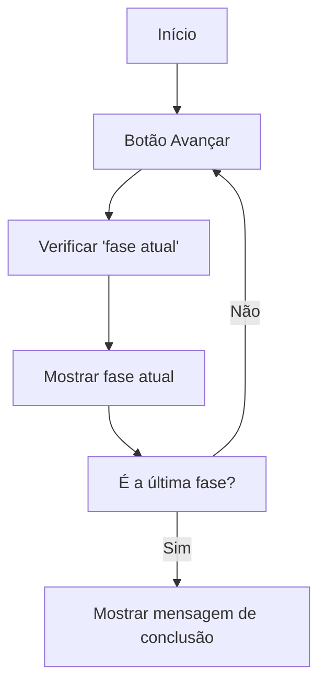

```mermaid
graph TD
    A[Início]
    B[Botão Avançar]
    C[Verificar 'fase atual']
    D[Mostrar fase atual]
    E[É a última fase?]
    F[Mostrar mensagem de conclusão]
    
    A --> B
    B --> C
    C --> D
    D --> E
    E -- Não --> B
    E -- Sim --> F

```