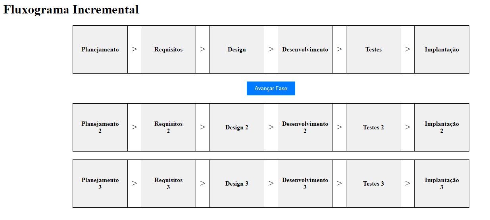

O **modelo incremental** é uma abordagem de desenvolvimento de software que se concentra na entrega gradual e iterativa de funcionalidades em um projeto ao longo do tempo. Em vez de criar o software em uma única fase monolítica, o desenvolvimento é dividido em incrementos ou partes menores, que são desenvolvidos, testados e entregues individualmente. Cada incremento adiciona novas funcionalidades ou aprimora as existentes, resultando em versões do software cada vez mais completas.

### Principais Características do Modelo Incremental:

1. **Entregas iterativas:** O desenvolvimento ocorre em ciclos repetitivos, nos quais cada ciclo produz um incremento funcional do software. Isso permite que as partes interessadas tenham acesso a funcionalidades utilizáveis em um estágio mais inicial do projeto.

2. **Priorização de funcionalidades:** As funcionalidades são priorizadas com base na importância para os usuários ou no valor de negócios. As funcionalidades de maior prioridade são implementadas primeiro, garantindo que as partes mais críticas do software sejam entregues mais cedo.

3. **Feedback contínuo:** Os ciclos de desenvolvimento iterativos facilitam a obtenção de feedback constante dos usuários e das partes interessadas. Isso ajuda a identificar problemas e fazer ajustes no software à medida que ele evolui.

4. **Flexibilidade e adaptabilidade:** O modelo incremental é mais flexível do que abordagens de desenvolvimento de software mais tradicionais, como o modelo em cascata. Ele permite que as equipes respondam a mudanças de requisitos ou prioridades de maneira mais eficaz.

5. **Redução de riscos:** Como os incrementos são desenvolvidos e testados individualmente, os riscos são mitigados mais cedo no processo de desenvolvimento. Isso ajuda a evitar surpresas desagradáveis ​​nas fases finais do projeto.

6. **Melhoria contínua:** Cada incremento serve como uma oportunidade de aprendizado. As lições aprendidas em um ciclo podem ser aplicadas aos ciclos subsequentes, melhorando a eficiência e a qualidade do desenvolvimento.

7. **Integração contínua:** À medida que novos incrementos são desenvolvidos, eles são integrados com os incrementos existentes. Isso garante que o software seja sempre funcionalmente consistente e que os problemas de integração sejam detectados e resolvidos precocemente.

8. **Fases de planejamento por incremento:** Cada incremento pode ter suas próprias fases de planejamento, desenvolvimento e teste. Isso permite que a equipe se concentre nas necessidades imediatas de cada incremento, sem a necessidade de planejar todo o projeto antecipadamente.

9. **Custos e prazos controlados:** O modelo incremental permite que as partes interessadas controlem melhor os custos e os prazos, uma vez que as entregas são feitas em partes menores e gerenciáveis.

Em resumo, o modelo incremental é uma abordagem que enfatiza a entrega contínua de valor ao cliente, a flexibilidade para lidar com mudanças e a redução de riscos durante o desenvolvimento de software. Ele é particularmente útil em projetos nos quais os requisitos podem evoluir ao longo do tempo ou quando é importante disponibilizar funcionalidades para os usuários o mais rápido possível.
