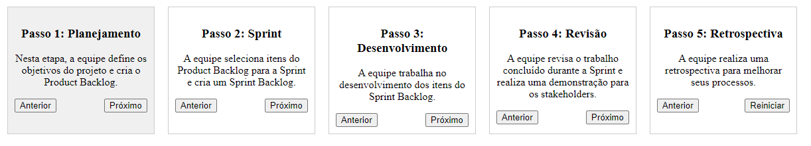

# Características Centradas em Pessoas no Scrum

O Scrum é uma das metodologias ágeis mais populares e é conhecido por suas características centradas em pessoas. Vou explicar algumas das principais características do Scrum relacionadas a essa abordagem voltada para pessoas:

## Equipes Auto-organizadas

No Scrum, as equipes são consideradas auto-organizadas, o que significa que têm a autonomia e a responsabilidade de determinar como realizar o trabalho. Isso incentiva a colaboração e a participação ativa dos membros da equipe, permitindo que eles tomem decisões conjuntas e adaptem o processo conforme necessário.

## Papéis Definidos

O Scrum define papéis específicos, incluindo:

- **Scrum Master**: Responsável por facilitar o processo e remover impedimentos.
- **Product Owner**: Responsável por representar os interesses do cliente e definir prioridades.
- **Equipe de Desenvolvimento**: Responsável por criar o software.

Esses papéis ajudam a definir responsabilidades claras e promovem a comunicação entre as partes interessadas.

## Iterações (Sprints)

O Scrum utiliza iterações de tempo fixo, chamadas de Sprints, que normalmente duram de 2 a 4 semanas. Durante uma Sprint, a equipe se concentra em um conjunto de funcionalidades ou tarefas prioritárias. Isso permite entregas frequentes e feedback contínuo, o que é benéfico para os membros da equipe e para os stakeholders.

## Revisões e Retrospectivas

Após o término de cada Sprint, o Scrum promove revisões para demonstrar o trabalho concluído aos stakeholders e obter feedback. Além disso, realiza retrospectivas para que a equipe avalie seu desempenho e identifique oportunidades de melhoria. Isso promove uma cultura de aprendizado e adaptação contínuos.

## Transparência

O Scrum enfatiza a transparência em todos os aspectos do processo. Isso significa que o progresso, os impedimentos, as prioridades e os desafios são visíveis para todos os membros da equipe e para os stakeholders. A transparência promove a confiança e a colaboração.

Em relação às situações reais do cotidiano de uma empresa em que o Scrum é mais utilizado para os processos de desenvolvimento de software, podemos destacar várias situações:

- **Desenvolvimento de Produtos Complexos**: O Scrum é especialmente eficaz quando se trata de desenvolver produtos de software complexos, nos quais os requisitos podem mudar ou evoluir ao longo do tempo. Ele permite que as equipes se adaptem rapidamente às mudanças e entreguem valor de forma incremental.

- **Startups e Empresas de Tecnologia**: Empresas que operam em ambientes altamente dinâmicos, como startups e empresas de tecnologia, muitas vezes adotam o Scrum devido à sua flexibilidade e capacidade de resposta às mudanças de mercado.

- **Projetos com Necessidades de Entrega Rápida**: Quando há uma necessidade de entrega rápida de funcionalidades ou protótipos para obter feedback do cliente o mais cedo possível, o Scrum é uma escolha popular devido às suas iterações curtas.

- **Colaboração Intensa com os Clientes**: Quando os clientes desejam estar envolvidos de perto no processo de desenvolvimento, o Scrum permite uma colaboração contínua por meio do papel do Product Owner, que representa os interesses do cliente.

- **Equipes Multidisciplinares e Distribuídas**: O Scrum é adequado para equipes multidisciplinares e até mesmo equipes distribuídas, desde que sejam capazes de manter a comunicação eficaz e atender às práticas Scrum.

Em resumo, o Scrum é uma metodologia ágil voltada para pessoas que promove a colaboração, a adaptação contínua e a entrega de valor de forma incremental. Ele é amplamente utilizado em situações em que a flexibilidade e a resposta às mudanças são essenciais para o sucesso no desenvolvimento de software.
