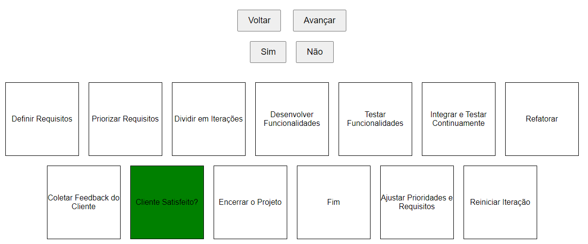

# Extreme Programming (XP) - Uma Metodologia Ágil

O Extreme Programming (XP) é uma das metodologias ágeis voltadas para o desenvolvimento de software. Essa abordagem se destaca por enfatizar a colaboração, a comunicação e a melhoria contínua em todos os aspectos do processo de desenvolvimento, com foco não apenas no produto final, mas também nas pessoas envolvidas no projeto.

## Características-Chave do XP

### Comunicação Constante
- A comunicação é priorizada e incentivada ao máximo, tanto entre membros da equipe de desenvolvimento quanto com os stakeholders do projeto.

### Feedback Rápido
- O XP enfatiza a obtenção de feedback rápido, frequentemente por meio de testes automatizados e integração contínua.

### Desenvolvimento Iterativo e Incremental
- O desenvolvimento é dividido em iterações curtas e frequentes, permitindo ajustes ágeis ao longo do caminho.

### Testes Automatizados
- A prática de desenvolver testes automatizados é fundamental no XP, garantindo que o software funcione conforme o esperado.

### Design Simples
- O XP promove a simplicidade no design do software, evitando complexidade desnecessária.

### Programação em Pares
- Os desenvolvedores frequentemente trabalham em pares, revisando o código um do outro enquanto colaboram na implementação.

### Propriedade Coletiva do Código
- Todos os membros da equipe são responsáveis pelo código-fonte, incentivando a colaboração.

### Cliente no Local
- O cliente está envolvido ativamente no projeto, trabalhando lado a lado com a equipe de desenvolvimento.

### Refatoração Contínua
- A equipe se dedica a melhorar continuamente o código existente.

## Situações de Uso

O XP é mais utilizado em situações onde:

1. **Requisitos Mudam Frequentemente:** Quando os requisitos do projeto estão em constante evolução, o XP permite adaptar-se facilmente a essas mudanças por meio de iterações curtas.

2. **Colaboração com o Cliente:** Quando a comunicação próxima com o cliente é essencial, o XP facilita essa colaboração.

3. **Projetos de Pequeno a Médio Porte:** É comumente utilizado em projetos de desenvolvimento de software de pequeno a médio porte.

4. **Qualidade do Código é Fundamental:** Em projetos onde a qualidade do código é crítica, o XP se destaca devido à ênfase em testes e refatoração contínua.

5. **Equipes de Tamanho Reduzido a Médio:** Funciona bem em equipes com até 10-12 membros, facilitando a comunicação eficaz.

6. **Cultura de Melhoria Contínua:** Empresas que valorizam a melhoria contínua e a adaptação às mudanças frequentes podem se beneficiar da mentalidade ágil do XP.

No entanto, a escolha da metodologia ágil, incluindo o XP, deve ser feita considerando as necessidades específicas do projeto e da equipe, e pode variar de acordo com o contexto e os requisitos do projeto de software em questão.
