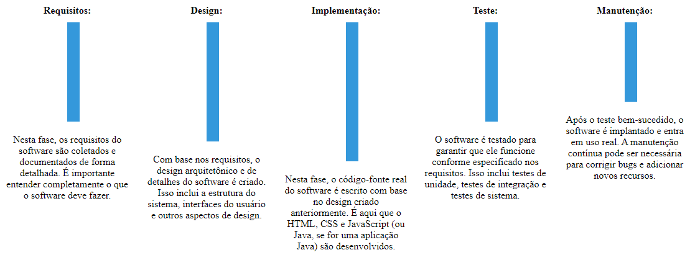

# Engenharia de Software

## Processos de Software

### Metodologias tradicionais (pesadas voltadas a processos)

#### Modelos

O Modelo Cascata é um dos modelos de desenvolvimento de software mais antigos e lineares.
Este modelo foi historicamente amplamente utilizado em projetos de desenvolvimento de software, 
especialmente em contextos em que os requisitos são bem compreendidos e estáveis desde o início do projeto.

Ele é composto por fases sequenciais, onde cada fase deve ser concluída antes que a próxima comece.
As principais fases do Modelo Cascata são:

Portanto, a escolha de implementar o Modelo Cascata depende da natureza específica do projeto, dos requisitos
e da cultura da empresa, mas ele é mais adequado para projetos onde os requisitos são altamente previsíveis
e não sujeitos a mudanças frequentes.
