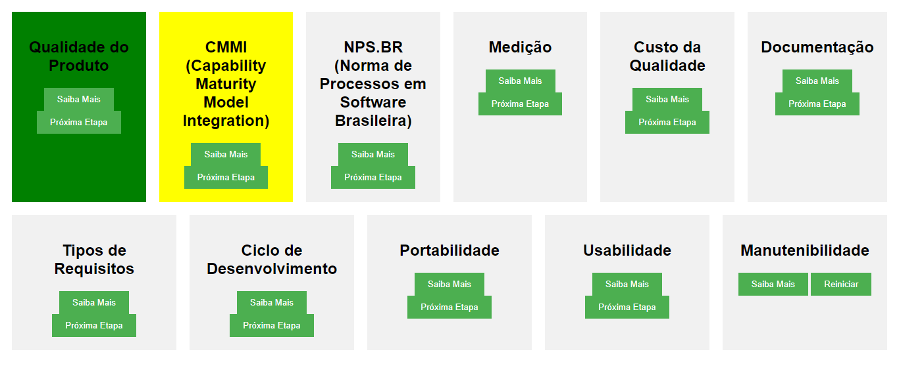

# Qualidade de Software

## Qualidade do Produto:

Refere-se à qualidade intrínseca do software, ou seja, quão bem o software atende aos requisitos e expectativas dos usuários.

## CMMI (Capability Maturity Model Integration):

O CMMI é um modelo de melhoria de processos que ajuda as organizações a melhorar seus processos de desenvolvimento e manutenção de software. Ele possui cinco níveis de maturidade, indo de inicial (nível 1) a otimizado (nível 5).

## NPS.BR (Norma de Processos em Software Brasileira):

É uma norma brasileira que estabelece requisitos para a melhoria de processos em software. Ela tem como objetivo aumentar a qualidade dos produtos e serviços de software no Brasil.

## Medição:

A medição envolve a coleta e análise de dados para avaliar a qualidade do software, o desempenho do processo e outros aspectos relevantes do desenvolvimento de software.

## Custo da Qualidade:

É uma abordagem que visa medir os custos associados à qualidade do software, incluindo custos de prevenção, avaliação e falhas.

## Documentação:

A documentação é essencial para o desenvolvimento de software de alta qualidade. Isso inclui documentos de requisitos, design, código, testes e manuais do usuário.

## Tipos de Requisitos:

 **Funcionais:** Descrevem as funcionalidades específicas que o software deve oferecer. Exemplos: 

- "O sistema deve permitir que os usuários façam login."
- "O tempo de resposta da consulta de produtos deve ser dada por: quantidade * 0,001. Ou seja, a cada 1000 produtos um segundo."
- " O aplicativo deve permitir que com no máximo 3 cliques, o usuário chegue a qualquer funcionalidade:  esse exemplo é uma diretriz de usabilidade, o que pode ser considerado um requisito não-funcional, pois não descreve uma funcionalidade específica do sistema, mas sim uma característica de usabilidade desejada."

**Não-funcionais:** Descrevem características não diretamente relacionadas a funcionalidades específicas, como desempenho, segurança e usabilidade.

Exemplos:

- "O sistema deve responder a todas as solicitações de login em menos de 2 segundos."
- "O sistema deve enviar a solicitação de impressão para o equipamento mais próximo ao computador solicitante:  isso pode ser considerado um requisito não-funcional relacionado à eficiência ou à otimização de recursos."
- "A foto do usuário deve ser anexada somente no formato .jpg: este é um exemplo de um requisito não-funcional relacionado à restrição de formato de dados."
- "A recuperação de senha deve ser por meio do link enviado no e-mail:  isso parece ser um requisito funcional específico relacionado à funcionalidade de recuperação de senha."

## Ciclo de Desenvolvimento de Software baseado na SQA (Software Quality Assurance):

A SQA envolve a definição de processos e padrões de qualidade que devem ser seguidos durante o ciclo de desenvolvimento de software. Isso inclui planejamento, execução de testes, revisões de código e melhoria contínua.

## Portabilidade:

A portabilidade refere-se à capacidade do software de ser executado em diferentes ambientes, sistemas operacionais e plataformas sem a necessidade de muitas modificações.

## Usabilidade:

A usabilidade envolve a facilidade de uso do software. Isso inclui a confiabilidade (quão confiável é o software), eficiência (quão rápido e eficaz é o software) e engenharia humana (consideração da experiência do usuário, design de interface, etc.).

## Manutenibilidade:

A manutenibilidade refere-se à facilidade de manter e modificar o software. Isso inclui facilidade de teste, facilidade de entendimento do código-fonte e facilidade de fazer alterações sem introduzir erros.
