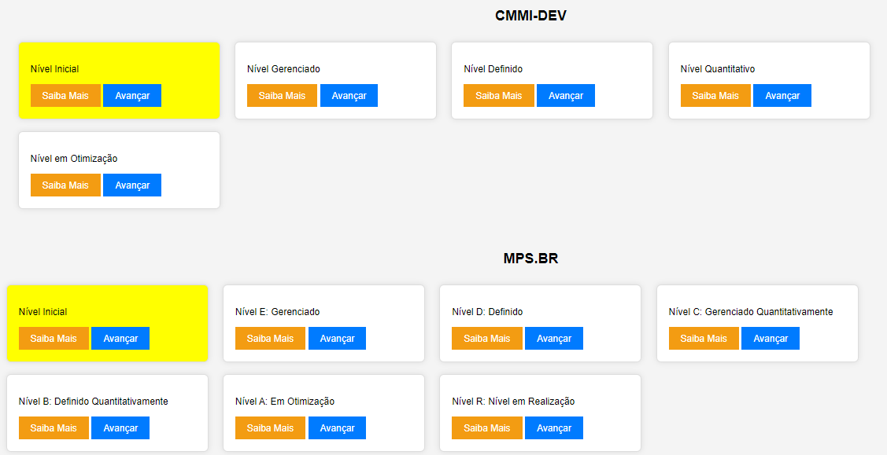

## Qualidade do Processo - Modelos guias CMMI e MPS.BR

### CMMI for Development (CMMI-DEV):

O **CMMI-DEV** é um modelo de maturidade de processos que se concentra no desenvolvimento de produtos e serviços. Ele é amplamente usado para avaliar e melhorar a qualidade dos processos em organizações de desenvolvimento de software. O CMMI-DEV possui cinco níveis de maturidade e é composto por áreas de processo em cada nível. As áreas de processo são agrupadas em quatro categorias principais:

- **Área de Gerenciamento de Processos**: Essas áreas se concentram em melhorar a gestão e a execução dos processos organizacionais. Exemplos incluem "Gestão de Requisitos" e "Gestão de Configuração".

- **Área de Gerenciamento de Projetos**: Estas áreas abordam a gestão eficaz de projetos de desenvolvimento de software. Exemplos incluem "Gestão de Projeto Integrada" e "Gestão de Riscos".

- **Área de Engenharia**: Essas áreas se concentram nas atividades técnicas envolvidas no desenvolvimento de software, como "Engenharia de Requisitos" e "Projeto de Sistema".

- **Área de Apoio**: Estas áreas se concentram em funções de suporte à engenharia de software, como "Gestão de Recursos Humanos" e "Garantia de Qualidade de Processo e Produto".

Os níveis de maturidade do CMMI-DEV são:

1. **Inicial**: Os processos são ad hoc e não são consistentes.
2. **Gerenciado**: Há um gerenciamento básico de projetos e processos.
3. **Definido**: Os processos são padronizados e documentados.
4. **Quantitativamente Gerenciado**: Os processos são controlados quantitativamente.
5. **Em Otimização**: Os processos são continuamente melhorados.

### MPS.BR for Development (MPS-SW):

O **MPS.BR** é um modelo brasileiro de melhoria de processos de software baseado no CMMI. Ele se concentra na melhoria de processos de software nas organizações brasileiras. O MPS-SW também possui áreas de processo em duas categorias principais: Processos de Projetos e Processos Organizacionais. Cada categoria inclui áreas de processo relacionadas à gestão e execução de projetos de software e à gestão de processos organizacionais.

O MPS.BR possui sete níveis de maturidade que representam diferentes estágios de evolução e melhoria dos processos de desenvolvimento de software. Esses níveis de maturidade são:

- **Nível F: Inicial** - Neste nível, os processos são informais e não são bem definidos. As atividades são realizadas de forma ad hoc, sem padrões ou documentação adequada.

- **Nível E: Gerenciado** - Neste nível, os processos são planejados e gerenciados de forma mais sistemática. Começa a haver uma maior documentação e controle das atividades.

- **Nível D: Definido** - Aqui, os processos são bem definidos, documentados e padronizados. A organização segue esses processos de forma consistente.

- **Nível C: Gerenciado Quantitativamente** - Além de ter processos bem definidos, a organização começa a medir e gerenciar quantitativamente o desempenho desses processos.

- **Nível B: Definido Quantitativamente** - Neste nível, a organização atinge um alto grau de maturidade, definindo metas quantitativas para seus processos e monitorando seu desempenho de forma rigorosa.

- **Nível A: Em Otimização** - No nível mais alto de maturidade, a organização busca continuamente otimizar seus processos para melhorar a eficiência e a qualidade.

- **Nível R: Nível em Realização** - Este nível é reservado para organizações que demonstraram maturidade em todos os aspectos, incluindo a integração de processos de desenvolvimento de software com processos de negócios.

A implementação do MPS.BR é gradual, e as organizações podem progredir de um nível para outro, conforme adotam e melhoram seus processos. Cada nível representa um patamar de maturidade mais alto em termos de gestão e controle de processos de software. A busca pela melhoria contínua é uma característica fundamental do modelo.
