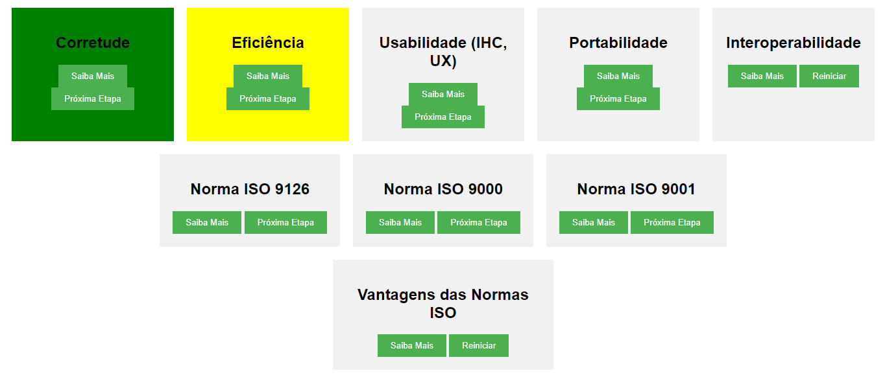

# Qualidade do Produto em Engenharia de Software

A qualidade de um produto de software desempenha um papel fundamental na satisfação do cliente e no sucesso no mercado. Vários aspectos da qualidade do produto são críticos para garantir que o software atenda às necessidades dos usuários e às expectativas do mercado. Aqui estão alguns desses aspectos-chave:

## Corretude

- A **corretude** se refere à capacidade do software de realizar suas funções de acordo com as especificações e requisitos sem erros ou falhas.
- Envolve a precisão dos cálculos, a execução adequada das funcionalidades e a consistência dos resultados.
- Garante que o software forneça saídas corretas e confiáveis em todas as situações.

## Eficiência

- A **eficiência** diz respeito à capacidade do software de executar suas tarefas de forma rápida e com uso eficiente dos recursos, como CPU, memória e armazenamento.
- Um software eficiente consome menos recursos e responde mais rapidamente às solicitações do usuário.
- A eficiência é crucial para garantir uma boa experiência do usuário e reduzir custos operacionais.

## Usabilidade (IHC, UX)

- A **usabilidade**, também conhecida como Interação Humano-Computador (IHC) e Experiência do Usuário (UX), refere-se à facilidade com que os usuários podem interagir e usar o software de forma eficaz.
- Envolve elementos como a interface do usuário, a navegabilidade, a clareza das instruções e a capacidade do software de atender às necessidades e expectativas dos usuários.
- Uma boa usabilidade aumenta a satisfação do usuário e reduz a curva de aprendizado.

## Portabilidade

- A **portabilidade** se relaciona com a capacidade do software de ser executado em diferentes ambientes e plataformas sem a necessidade de grandes modificações.
- Isso inclui a capacidade de migrar o software de um sistema operacional para outro, de um dispositivo para outro ou de uma arquitetura para outra.
- A portabilidade é importante para atender a uma variedade de clientes e dispositivos.

## Interoperabilidade

- A **interoperabilidade** refere-se à capacidade do software de se comunicar e funcionar de forma eficaz com outros sistemas, aplicativos ou componentes, muitas vezes em diferentes plataformas.
- É crucial em cenários onde vários sistemas precisam trocar dados e informações de forma transparente e sem problemas.
- A interoperabilidade é fundamental para a integração de sistemas em empresas e ambientes tecnológicos complexos.

Cada um desses aspectos desempenha um papel importante na criação de software de alta qualidade que atenda às necessidades dos usuários e às demandas do mercado.

## Normas ISO Relacionadas e Suas Vantagens

As normas ISO são importantes na garantia da qualidade dos produtos de software e fornecem diretrizes e estruturas que auxiliam as organizações nesse processo. Vamos abordar algumas delas e suas vantagens:

### ISO 9126

- A **ISO 9126** é uma norma internacional que fornece diretrizes para avaliar a qualidade do software em termos de suas características e subcaracterísticas.
- As principais características incluem funcionalidade, confiabilidade, usabilidade, eficiência, manutenibilidade e portabilidade.

**Vantagens**:
- Melhora a qualidade do software.
- Facilita a comunicação entre os stakeholders.
- Ajuda na identificação de áreas de melhoria.
- Aumenta a satisfação do cliente.

### ISO 9000

- A série **ISO 9000** estabelece princípios de gestão da qualidade que uma organização deve seguir.
- Define termos e conceitos relacionados à qualidade e fornece diretrizes para sistemas de gestão da qualidade.

**Vantagens**:
- Melhora a eficiência operacional.
- Aumenta a satisfação do cliente.
- Promove a cultura da qualidade na organização.
- Ajuda na conformidade regulatória.

### ISO 9001

- A **ISO 9001** estabelece requisitos para sistemas de gestão da qualidade em uma organização.
- Define uma estrutura para documentar e melhorar processos, incluindo o desenvolvimento de software.

**Vantagens**:
- Melhora a consistência na entrega de produtos e serviços.
- Aumenta a confiança dos clientes.
- Facilita a entrada em mercados internacionais.
- Ajuda a reduzir erros e retrabalho.

A implementação dessas normas ISO na engenharia de software oferece diversas vantagens, incluindo:

- Melhoria da qualidade do software, levando a produtos mais confiáveis e satisfatórios para os usuários.
- Melhoria na gestão da qualidade em toda a organização, resultando em processos mais eficientes.
- Aumento da competitividade no mercado global, já que muitas organizações exigem conformidade com normas ISO.
- Redução de riscos, como falhas de segurança e problemas de conformidade regulatória.
- Aumento da confiança dos clientes, parceiros e partes interessadas de que a organização está comprometida com a qualidade.
- Facilitação da melhoria contínua, pois as normas ISO incentivam a monitorização e aprimoramento constantes dos processos.

Dessa forma, a implementação de normas ISO na engenharia de software é uma abordagem eficaz para alcançar produtos de alta qualidade, melhorar a eficiência e garantir a satisfação do cliente, proporcionando uma vantagem competitiva no mercado.
