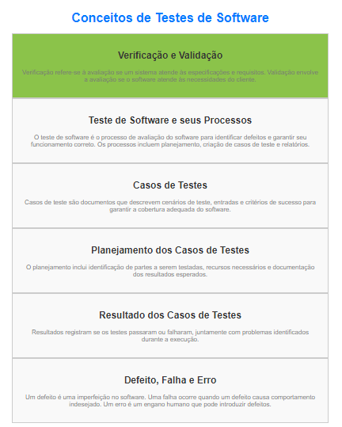

## Visão Geral de Conceitos Relacionados a Testes de Software

### Verificação e Validação

- **Verificação:** Refere-se ao processo de avaliar se um sistema atende às especificações e requisitos estabelecidos. Envolve atividades como revisões, inspeções e análises de código para garantir que o software tenha sido construído corretamente.

- **Validação:** Envolve a avaliação do software para garantir que ele atenda aos requisitos do usuário e que seja útil para seus propósitos. Isso inclui testes de aceitação e testes de sistema para garantir que o software atenda às necessidades do cliente.

### Teste de Software e seus Processos

- O teste de software é o processo de avaliação de um sistema de software para identificar e corrigir defeitos e garantir que ele funcione conforme o esperado.

- Os processos de teste de software incluem planejamento de teste, criação de casos de teste, execução de testes, relatórios de resultados e correção de defeitos.

### Casos de Testes

- Casos de teste são documentos que descrevem os cenários a serem testados, incluindo entradas, ações a serem realizadas e critérios de sucesso. Eles ajudam os testadores a garantir que diferentes aspectos do software sejam testados de maneira abrangente.

### Testar Todos os Limites das Condições

- Testar todos os limites das condições significa verificar como o software se comporta quando os dados de entrada estão nos limites extremos, como valores mínimos e máximos. Isso é importante para identificar problemas de desempenho e validação de entrada.

### Planejamento dos Casos de Testes

- O planejamento de casos de teste envolve a identificação de quais partes do software serão testadas, quem fará os testes, quais recursos são necessários e como os resultados serão documentados. É uma parte crítica do processo de teste.

### Resultado dos Casos de Testes

- Os resultados dos casos de teste registram o que aconteceu durante a execução dos testes. Isso inclui se o teste passou ou falhou, quaisquer problemas encontrados e informações adicionais relevantes.

### Defeito, Falha e Erro

- Um defeito (ou bug) é uma imperfeição no software que pode causar comportamento indesejado.

- Uma falha ocorre quando um defeito faz com que o software não atenda aos requisitos ou não funcione conforme o esperado durante a execução.

- Um erro é um engano humano que pode levar à introdução de defeitos no software.

É importante entender esses conceitos para realizar testes eficazes de software e garantir a qualidade do produto final. A combinação de verificação, validação e planejamento adequado dos testes ajuda a identificar e corrigir problemas antes que o software seja lançado.

### Depuração: aplicações

A depuração, no contexto da programação de computadores, é o processo de identificar, analisar e corrigir erros ou bugs em um programa de software. Ela desempenha um papel fundamental no desenvolvimento de software, pois ajuda os desenvolvedores a garantir que seus programas funcionem conforme o esperado e sejam livres de erros.

Aqui estão alguns conceitos-chave relacionados à depuração:

- **Erro ou Bug**: Um erro de programação, também conhecido como bug, é um comportamento indesejado ou inesperado em um programa de software. Pode resultar em falhas, comportamento incorreto ou resultados inesperados.

- **Breakpoint**: Um breakpoint é um ponto específico no código-fonte onde um desenvolvedor deseja pausar a execução do programa para examinar o estado do programa, como valores de variáveis, pilha de chamadas e assim por diante. Breakpoints são úteis para investigar problemas em locais específicos do código.

- **Passo a passo (Step-by-Step)**: Durante a depuração, os desenvolvedores podem executar o programa linha por linha, observando como as variáveis e o estado do programa mudam a cada passo. Isso ajuda a identificar a origem de um erro.

- **Inspeção de Variáveis**: Os desenvolvedores podem examinar os valores das variáveis ​​em tempo de execução para verificar se eles estão corretos ou se estão contribuindo para um erro. Isso geralmente é feito usando um depurador, que permite visualizar o estado do programa durante a execução.

- **Depurador (Debugger)**: Um depurador é uma ferramenta de software que permite aos desenvolvedores pausar, inspecionar e acompanhar a execução de um programa. Ele fornece recursos como breakpoints, visualização de variáveis e controle de fluxo de execução.

- **Rastreamento de Pilha (Stack Trace)**: Um rastreamento de pilha é uma lista de chamadas de função que levaram à ocorrência de um erro. Ele pode ajudar a identificar a origem de um problema, mostrando a sequência de chamadas de função que levou ao erro.

- **Testes Unitários**: Testes unitários são parte integrante da depuração. Eles são escritos pelos desenvolvedores para verificar a funcionalidade de partes específicas do código. Quando um teste unitário falha, os desenvolvedores podem usar a depuração para encontrar e corrigir o erro.

- **Registro de Eventos (Logging)**: A inclusão de mensagens de log no código é uma técnica comum de depuração. Os desenvolvedores podem inserir mensagens de log em pontos-chave do programa para registrar informações sobre o estado do programa e os valores das variáveis.

- **Reprodução do Erro (Reproducibility)**: Em muitos casos, a depuração é mais eficaz quando um erro pode ser reproduzido de forma consistente. Isso permite que os desenvolvedores examinem o erro em um ambiente controlado.

- **Correção de Erros**: Depois de identificar a causa de um erro, os desenvolvedores fazem as correções necessárias no código-fonte para resolver o problema. Isso pode envolver a modificação do código, a atualização de variáveis ou a reformulação de algoritmos.

A depuração é uma habilidade essencial para programadores, pois ajuda a manter a qualidade do software e a garantir que os programas funcionem corretamente. É um processo iterativo e muitas vezes desafiador, mas é fundamental para o desenvolvimento de software de alta qualidade.

## Necessidade e Aplicações da Depuração

- **Teste mal-sucedido**: A necessidade da depuração decorre de um teste mal-sucedido. A depuração geralmente é necessária quando um programa ou código não funciona como esperado, após um teste ou execução inicial.
- Um dos recursos da depuração inclui a inspeção de variáveis. Uma das principais técnicas de depuração envolve a inspeção e monitoramento das variáveis do programa para entender como seus valores estão mudando e identificar possíveis problemas.
- **Ocorre após testes**: A depuração é um processo que ocorre após testes, quando problemas são identificados, a fim de encontrar e corrigir erros no código. Não se trata de simplificar o teste, mas sim de identificar e corrigir os problemas que surgiram durante a execução ou teste do programa.
