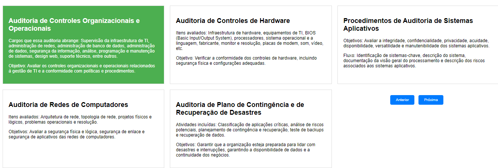

# Tipos de Auditoria de Sistemas de Informação

## Gestão da Estrutura Organizacional

A área que trata das estruturas internas das organizações, incluindo regras, costumes, políticas administrativas e procedimentos, é conhecida como "Gestão Organizacional" ou "Gestão da Estrutura Organizacional". A gestão organizacional envolve o planejamento, a organização, a coordenação, a implementação e o controle de todos os aspectos internos de uma organização, a fim de alcançar seus objetivos estratégicos e operacionais. Isso inclui a definição de políticas internas, a criação de procedimentos, a gestão de recursos humanos, a governança corporativa e a implementação de sistemas de controle interno, como auditorias, para garantir que as operações estejam em conformidade com as diretrizes estabelecidas pela empresa. É a área que trata das estruturas internas das organizações é frequentemente associada ao controle centralizado, onde as decisões e o controle são centralizados em uma única autoridade ou entidade. 

## Auditoria de Controles Organizacionais e Operacionais

**Cargos que essa auditoria abrange:** Supervisão da infraestrutura de TI, administração de redes, administração de banco de dados, administração de dados, segurança da informação, análise, programação e manutenção de sistemas, design web, suporte técnico, entre outros. Caso, nos processos de auditoria em sistemas da informação, o controle geral apresentar deficiências afetará o comprometimento da confiabilidade nos controles individuais. Quando o controle geral apresenta deficiências, isso pode afetar a confiabilidade dos controles individuais que dependem dele.

**Objetivo:** Avaliar os controles organizacionais e operacionais relacionados à gestão de TI e a conformidade com políticas e procedimentos.

## Auditoria de Controles de Hardware

**Itens avaliados:** Infraestrutura de hardware, equipamentos de TI, BIOS (Basic Input/Output System), processadores, sistema operacional e a linguagem, fabricante, monitor e resolução, placas de modem, som, vídeo, etc.

**Objetivo:** Verificar a conformidade dos controles de hardware, incluindo segurança física e configurações adequadas.

## Procedimentos de Auditoria de Sistemas Aplicativos

**Objetivos:** Avaliar a integridade, confidencialidade, privacidade, acuidade, disponibilidade, versatilidade e manutenibilidade dos sistemas aplicativos.

**Fluxo:** Identificação de sistemas-chave, descrição do sistema, documentação da visão geral do processamento e descrição dos riscos associados aos sistemas aplicativos.

## Auditoria de Redes de Computadores

**Itens avaliados:** Arquitetura de rede, topologia de rede, projetos físicos e lógicos, problemas operacionais e resolução.

**Objetivos:** Avaliar a segurança física e lógica, segurança de enlace e segurança de aplicativos das redes de computadores.

## Auditoria de Plano de Contingência e de Recuperação de Desastres

**Atividades incluídas:** Classificação de aplicações críticas, análise de riscos potenciais, planejamento de contingência e recuperação, teste de backups e recuperação de dados.

**Objetivos:** Garantir que a organização esteja preparada para lidar com desastres e interrupções, garantindo a disponibilidade de dados e a continuidade dos negócios.
