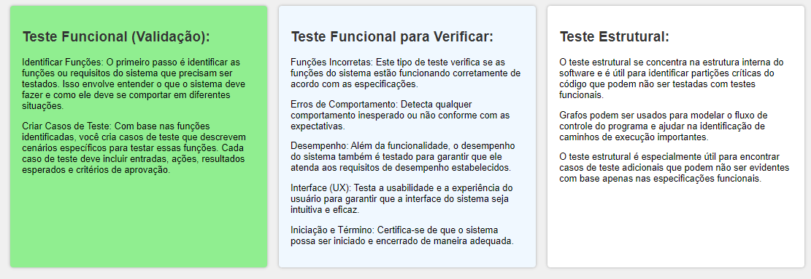

# Técnicas de Testes

## Teste Funcional (Validação):

### Identificar Funções:
O primeiro passo é identificar as funções ou requisitos do sistema que precisam ser testados. Isso envolve entender o que o sistema deve fazer e como ele deve se comportar em diferentes situações.

### Criar Casos de Teste:
Com base nas funções identificadas, você cria casos de teste que descrevem cenários específicos para testar essas funções. Cada caso de teste deve incluir entradas, ações, resultados esperados e critérios de aprovação.

### Teste Funcional para Verificar:

- **Funções Incorretas:** Este tipo de teste verifica se as funções do sistema estão funcionando corretamente de acordo com as especificações.

- **Erros de Comportamento:** Detecta qualquer comportamento inesperado ou não conforme com as expectativas.

- **Desempenho:** Além da funcionalidade, o desempenho do sistema também é testado para garantir que ele atenda aos requisitos de desempenho estabelecidos.

- **Interface (UX):** Testa a usabilidade e a experiência do usuário para garantir que a interface do sistema seja intuitiva e eficaz.

- **Iniciação e Término:** Certifica-se de que o sistema possa ser iniciado e encerrado de maneira adequada.

## Teste Estrutural:

- O teste estrutural se concentra na estrutura interna do software e é útil para identificar partições críticas do código que podem não ser testadas com testes funcionais.

- Grafos podem ser usados para modelar o fluxo de controle do programa e ajudar na identificação de caminhos de execução importantes.

- O teste estrutural é especialmente útil para encontrar casos de teste adicionais que podem não ser evidentes com base apenas nas especificações funcionais.

No entanto, é importante observar que as técnicas de teste não são mutuamente exclusivas. Em muitos casos, uma abordagem mista que combina testes funcionais e estruturais é a mais eficaz para garantir que o software seja testado de maneira completa e abrangente. Além disso, outras técnicas, como testes de regressão, testes de unidade e testes de segurança, também desempenham um papel importante na garantia da qualidade do software. A escolha das técnicas de teste depende das características específicas do projeto e dos requisitos do sistema.
